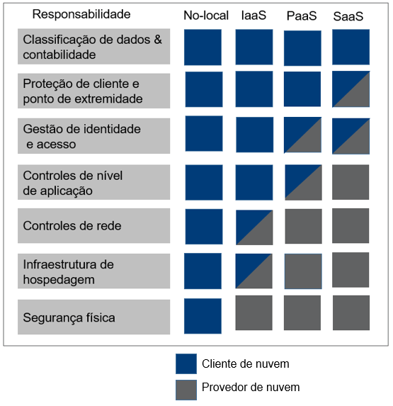

# AZ-900
# Introdução aos conceitos básicos do Microsoft Azure
## O que são Conceitos Básicos do Azure?
* Os Conceitos Básicos do Azure são uma série de três roteiros de aprendizagem que ajudam você a se familiarizar com o Azure e seus diversos serviços e recursos

## Por que devo estudar os Conceitos Básicos do Azure?
* Independentemente de suas metas, os Conceitos Básicos do Azure têm algo para você. Você deve fazer este curso se: Desejar obter a certificação oficial da Microsoft (AZ-900)
    * Descrever os conceitos da nuvem 25-30%
    * Descrever a arquitetura e os serviços do Azure 35 a 40%
    * Descrever o gerenciamento e a governança do Azure

-------------------------

# Introdução à computação em nuvem
- Definir computação em nuvem.
- Descrever o modelo de responsabilidade compartilhada.
- Definir modelos de nuvem, incluindo público, privado e híbrido.
- Identificar os casos de uso apropriados para cada modelo de nuvem.
- Descrever o modelo baseado no consumo.
- Comparar os modelos de preços de nuvem.

## O que é computação em nuvem
 * é a entrega de serviços de computação pela Internet
 * ela não precisa ficar restrita pela infraestrutura física da mesma forma que um datacenter tradicional
 
 ## Descrever o modelo de responsabilidade compartilhada
 * IaaS (infraestrutura como serviço)
    * A IaaS coloca a maior responsabilidade sobre o consumidor, com o provedor de nuvem sendo responsável pelas questões básicas de segurança física, energia e conectividade
 * PaaS (plataforma como serviço)
    * A PaaS, sendo um meio termo entre IaaS e SaaS, situa-se no meio desses dois cenários e distribui uniformemente a responsabilidade entre o provedor de nuvem e o consumidor.
 * SaaS (software como serviço).
    * O SaaS coloca a maior parte da responsabilidade no provedor de nuvem

Responsabilidade Minhas(Empresa)
- Informações e dados armazenados na nuvem
- Dispositivos que têm permissão para se conectar à nuvem (telefones celulares, computadores e assim por diante)
- Contas e identidades das pessoas, serviços e dispositivos em sua organização

Responsabilidade Nuvem(Provedor)
- Datacenter físico
- Rede física
- Hosts físicos

## Definir modelos de nuvem
- privado
    - As organizações têm controle total sobre os recursos e a segurança
    - Os dados não são colocados com os dados de outras organizações
    - O hardware deve ser comprado para o início e a manutenção
    - As organizações são responsáveis pela manutenção e pelas atualizações de hardware

- público 
    - Nenhuma despesa de capital para escalar verticalmente
    - Os aplicativos podem ser provisionados e desprovisionados rapidamente
    - As organizações pagam apenas pelo que utilizam
    - As organizações não têm controle total sobre os recursos e a seguranç

- híbrido
    - Fornece a maior flexibilidade
    - As organizações determinam o local para executar os aplicativos
    - As organizações controlam a segurança, a conformidade ou os requisitos legais
## Várias nuvens
* é um cenário de várias nuvens. Em um cenário de várias nuvens, você usa vários provedores de nuvem pública.
## Azure Arc
* O Azure Arc pode ajudar a gerenciar o seu ambiente de nuvem, seja uma nuvem pública exclusivamente no Azure,
## Solução VMware no Azure
* A Solução VMware no Azure permite executar suas cargas de trabalho do VMware no Azure com integração e escalabilidade total.

## Descrever o modelo baseado em consumo
- Ao comparar modelos de infraestrutura de TI, há dois tipos de despesas a serem consideradas. 
    - CapEx (despesas de capital) é uma despesa inicial única para comprar ou proteger recursos tangíveis
    - OpEx (despesas operacionais) é o gasto de capital em serviços ou produtos ao longo do tempo.

A computação em nuvem se enquadra na OpEx porque opera em um modelo baseado em consumo. Na computação em nuvem, você não paga pela infraestrutura física, pela eletricidade, pela segurança nem por nada que esteja associado à manutenção de um datacenter. Você paga pelos recursos de TI que usa

- Sem custos prévios.
- Não há necessidade de comprar nem gerenciar uma infraestrutura cara que os usuários talvez não usem na capacidade máxima.
- A capacidade de pagar para obter mais recursos quando necessário.
- A capacidade de parar de pagar por recursos que não são mais necessários.

